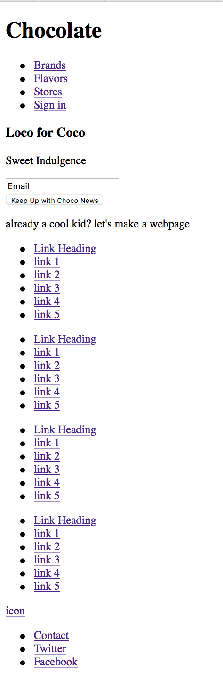
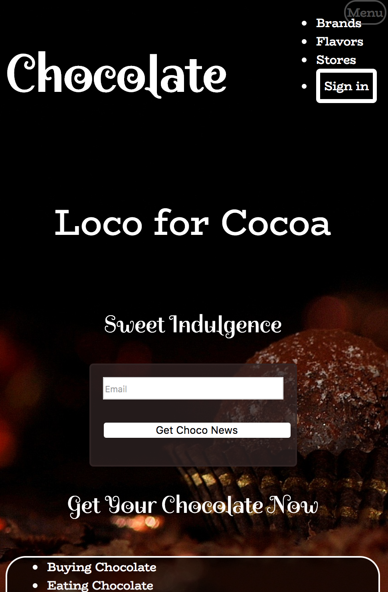

*I created a landing page for my chocolate-themed website.
*I made use of  pure CSS/HTML, flexboxes, and mediaquery to layout images and text, and ensure that my webpage was compatible with a narrow phone friendly version.
*I incorporated various colors, varying transparencies, font styles from google fonts, and images from pexels.com
*I incorporated effects for visited, active, hovering, and unvisited links. I also added softened and rounded borders on text boxes.
*I used the checkbox hack to toggle the top right menu button in the narrow window so it would display more menu options when clicked.

Original html screen cap:

Top Menu Checkbox hack:

